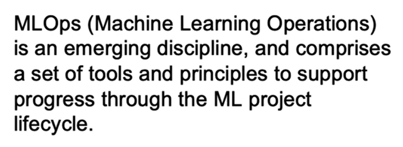
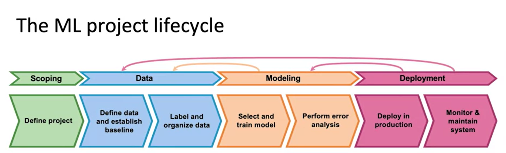
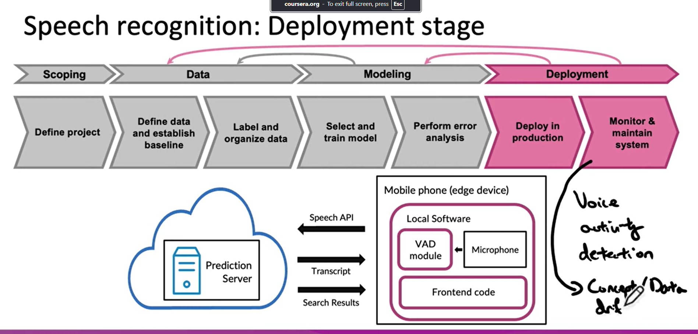

# ML Project Lifecycle

> Summary Notes
    In the video, the instructor discusses the machine learning project lifecycle, which provides a framework for planning and executing machine learning projects. The major steps of the lifecycle are as follows:

    Scoping: Define the project and determine the problem or task that machine learning will be applied to. Identify the variables X and Y.

    Data Collection: Acquire the necessary data for the algorithm. This involves defining the data, establishing a baseline, and organizing and labeling the data.

    Model Training: Select and train the machine learning model using the collected data. Perform error analysis to identify areas for improvement and iterate on the model if needed.

    Deployment: Deploy the trained model into a production environment. This involves writing the necessary software and ensuring the system is monitored and maintained.

    Maintenance: Continuously monitor the system, track incoming data, and analyze errors. This may involve retraining the model, updating the data, or making adjustments based on live feedback.
    The instructor emphasizes the importance of error analysis throughout the lifecycle. Error analysis helps identify patterns, debug the model, and make targeted improvements. It also highlights that machine learning projects are iterative, and feedback from live traffic is crucial for optimizing system performance.

    The video concludes by highlighting the usefulness of the machine learning project lifecycle framework for a wide range of applications. The instructor encourages viewers to use the framework to plan their own machine learning projects and acknowledges the contributions of Steven Layett and Daniel Pipryata in developing the diagram.

    Overall, the video provides an overview of the machine learning project lifecycle and emphasizes the significance of error analysis and iterative improvement in achieving successful machine learning deployments.

## **Speech Recognition Basics**
    
   

    

    Full life cycle of a machine learning project, using speech recognition as an example. The course covers various stages of the project, including scoping, data definition, modeling, and deployment. Here are the key concepts covered in the course:

    Scoping: The first step in building a valuable production deployment speech recognition system is to define the project and set goals and metrics. This includes estimating accuracy, latency, throughput, and resource requirements.

    Data Definition: In this stage, you define the data and establish a baseline. One of the challenges in speech recognition systems is data label consistency. Inconsistencies in transcribing audio can affect the performance of the learning algorithm. The course provides best practices for spotting and correcting inconsistencies.

    Modeling: In the modeling stage, you select and train the model architecture. The course emphasizes the importance of optimizing the data and hyperparameters to achieve high performance. Error analysis helps identify areas where the model falls short and guides improvements in data and code.

    Deployment: Once the model is trained and error analysis suggests it's working well enough, you can deploy the speech recognition system. This involves implementing the system on edge devices like mobile phones and using prediction servers in the cloud. Monitoring and maintaining the system is crucial to address concept drift or data drift.
    Throughout the course, you will learn practical strategies and frameworks for building and deploying machine learning systems effectively. The course also covers topics like data quality, performance optimization, and addressing challenges in production deployment.

## Questions

    ***Question 1*** What are the major steps in the machine learning project lifecycle?

    *Answer* The major steps in the machine learning project lifecycle are as follows:

    Scoping: Define the project and determine what you want to apply machine learning to. Identify the variables X and Y.

    Data Collection: Acquire the data needed for your algorithm. This includes defining the data, establishing a baseline, labeling and organizing the data.

    Model Training: Select and train the model. Perform error analysis and iterate on the model if necessary.

    Deployment: Deploy the model in production and write the necessary software. Monitor the system, track incoming data, and maintain the system.

    Maintenance: Continuously analyze errors, retrain the model if needed, and update the data based on live feedback.

    --------------------------------

    ***How can error analysis help in improving the performance of a machine learning system?***

    *Answer*Error analysis plays a crucial role in improving the performance of a machine learning system. Here's how error analysis can help:

    Identify Patterns: By analyzing the errors made by the model, you can identify patterns or specific types of mistakes that the model is consistently making. This helps you understand the weaknesses of the model and focus on improving those areas.

    Debugging: Error analysis helps in debugging the model by identifying the root causes of errors. It allows you to investigate why certain predictions are incorrect and find potential issues in the data, model architecture, or training process.

    Iterative Improvement: Error analysis enables an iterative improvement process. By understanding the specific errors made by the model, you can make targeted changes to the data, model, or training process to address those errors. This iterative approach helps in gradually improving the model's performance.

    Data Collection and Labeling: Error analysis can reveal issues with the data, such as incorrect labels or missing data. By identifying these issues, you can improve the data collection and labeling process, ensuring the model has high-quality data to learn from.

    Performance Evaluation: Error analysis helps in evaluating the performance of the model objectively. By analyzing the errors, you can measure the model's accuracy, precision, recall, or other performance metrics. This evaluation provides insights into the model's strengths and weaknesses and guides further improvements.
    Overall, error analysis is a critical step in the machine learning lifecycle as it helps in understanding and addressing the limitations of the model, leading to improved performance and reliability.

    -------------------

    ***What are some best practices for deploying a machine learning system in production and maintaining it?***

    *Answer* When deploying a machine learning system in production and maintaining it, there are several best practices to consider. Here are some key recommendations:

    Version Control: Use version control to manage your machine learning models, code, and data. This allows you to track changes, revert to previous versions if needed, and collaborate effectively with team members.

    Continuous Integration and Deployment (CI/CD): Implement CI/CD pipelines to automate the deployment process. This ensures that changes to the model or code are tested, validated, and deployed in a controlled manner, reducing the risk of errors and downtime.

    Monitoring and Logging: Set up monitoring and logging systems to track the performance and behavior of your deployed machine learning system. This includes monitoring data input/output, model performance metrics, and system health. Logs can help in debugging and identifying issues quickly.

    Error Handling and Alerting: Implement robust error handling mechanisms to handle unexpected scenarios and failures gracefully. Set up alerts and notifications to be notified of any critical errors or anomalies in the system's behavior.

    Data Drift Detection: Monitor for data drift, which refers to changes in the distribution or characteristics of the input data over time. Detecting data drift helps in identifying when the model's performance may degrade and triggers the need for retraining or updating the model.

    Security and Privacy: Ensure that your machine learning system adheres to security and privacy best practices. Protect sensitive data, implement access controls, and follow industry standards and regulations to maintain data privacy and security.

    Regular Model Evaluation and Retraining: Continuously evaluate the performance of your deployed model and retrain it periodically using new data. This helps in maintaining the model's accuracy and adapting to changing patterns in the data.

    Documentation and Knowledge Sharing: Document your deployment process, system architecture, and any specific considerations or dependencies. This helps in knowledge sharing, troubleshooting, and onboarding new team members.
    By following these best practices, you can ensure the successful deployment and maintenance of your machine learning system in a production environment.

