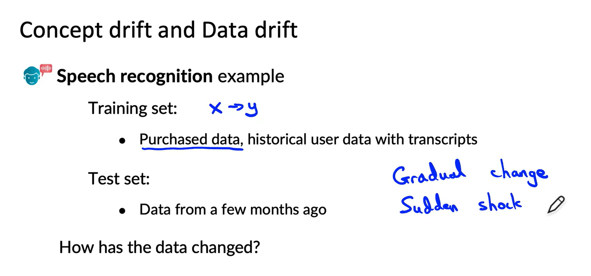
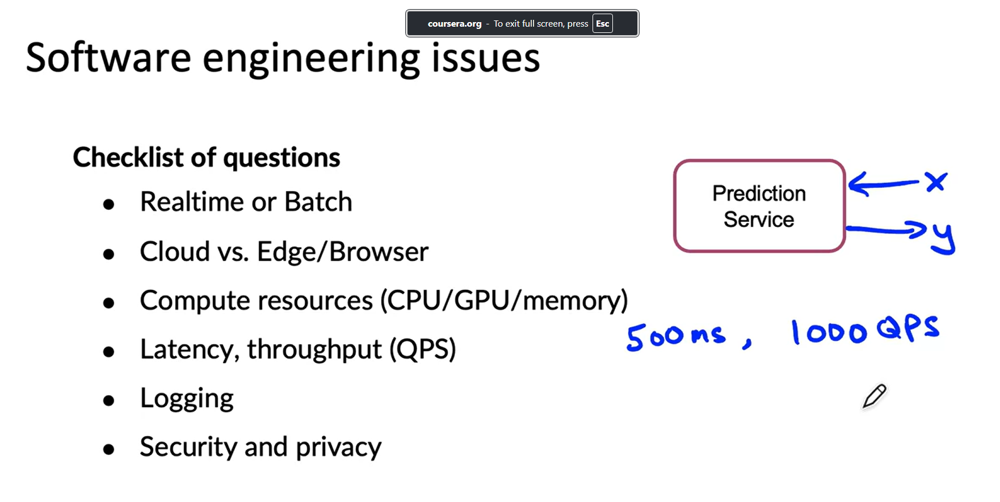
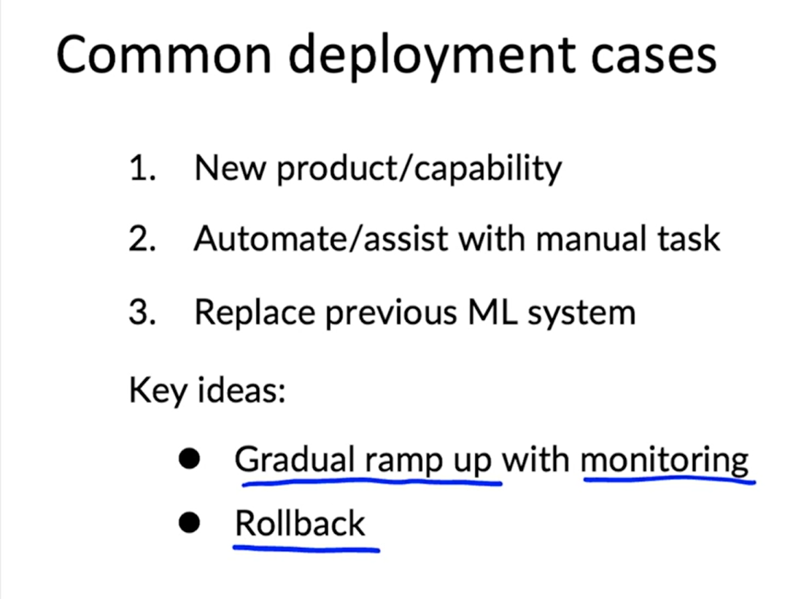
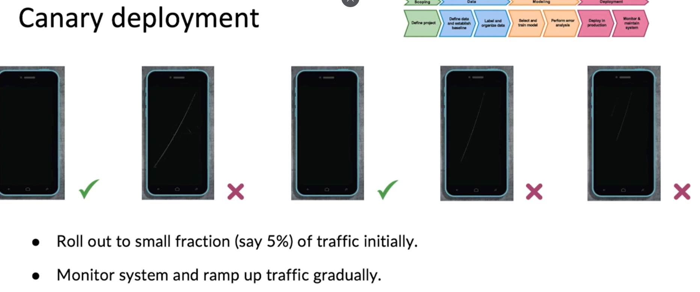
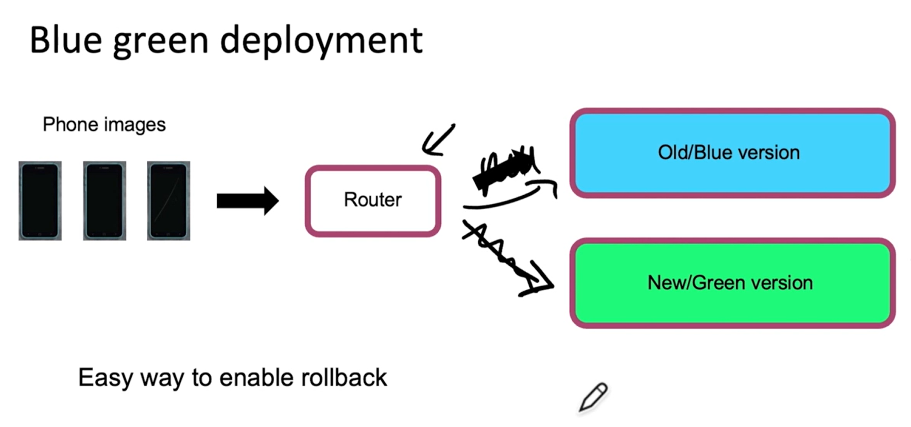
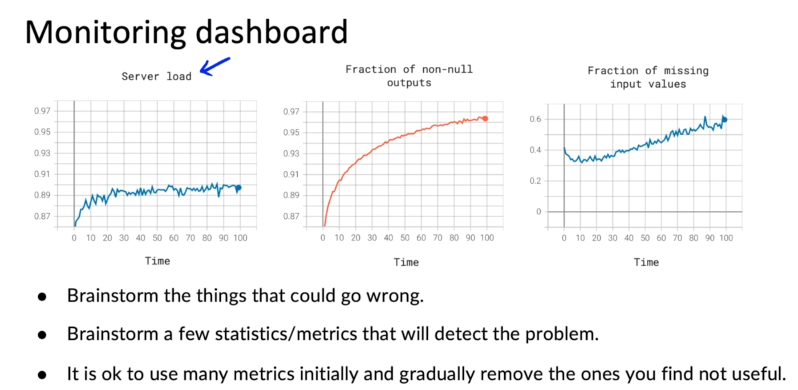
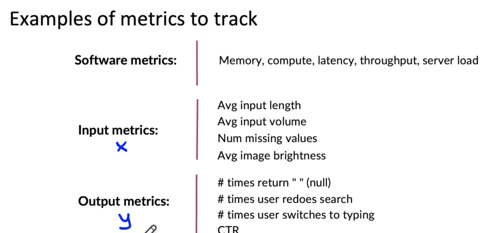
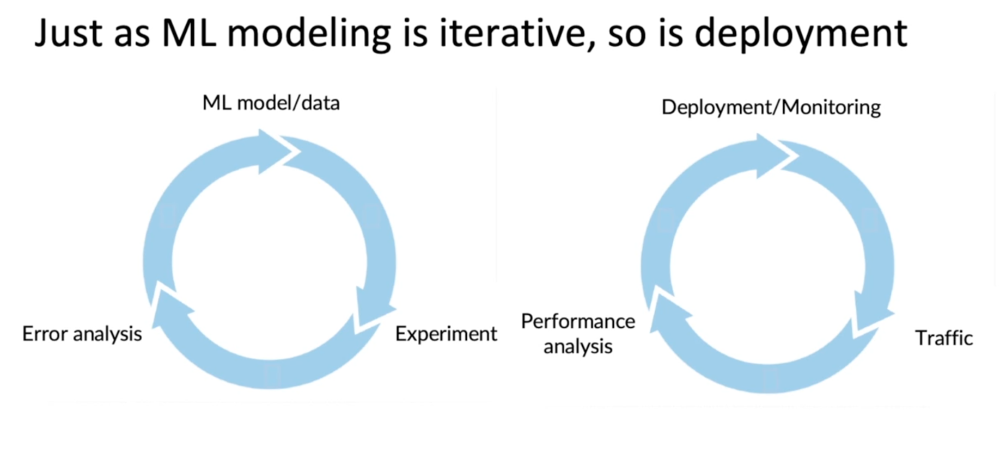

## Deployment Issues

1.Statistical Issues

    a. Data Quality: Ensuring high-quality data is paramount for accurate model predictions. This includes addressing issues like missing values, outliers, and biases.

    b. Model Selection and Tuning: Choosing the right model for the task and fine-tuning its parameters can significantly impact performance. Overfitting and underfitting are common pitfalls.

    c. Interpretability and Explainability: Understanding how the model makes decisions is crucial for building trust and identifying potential biases. This can be challenging for complex models like deep neural networks.

    d. Monitoring and Evaluation: Continuously monitoring the model's performance in production is essential to detect and address issues like concept drift and data quality degradation.

2.Software Issue

    a. Scalability and Performance: Handling large volumes of data and ensuring fast response times can be challenging, especially for real-time applications.
    
    b.Integration with Existing Systems: Integrating the model with existing infrastructure and workflows can require significant development effort.
    
    c.Security and Privacy: Protecting sensitive data and ensuring model robustness against adversarial attacks are critical concerns.
    
    d.Versioning and Reproducibility: Maintaining different versions of the model and ensuring reproducibility of results are important for managing changes and debugging issues.

## Deployment Patterns

1. Shadow Deployment:
    
    purpose of this is it allows u to gather the data how the learning algorith is performing  and how that compares the human judgement. And can judge if it can be used in future.

2. Canary Deployment:
    

    When you are ready for your algo to make the decision common strategy followed is Canary deployment.Canary deployment is a software release strategy that aims to minimize the risk of introducing new features or changes to a production environment. It involves gradually rolling out the update to a small subset of users, known as the "canaries," while the existing version continues to serve the majority of users. This allows for controlled monitoring and rollback if any issues arise.

3. Blue Green Deployemnt:
    
    Blue-green deployment is a software release strategy that involves running two identical production environments, typically referred to as "blue" and "green." The new version of the application is deployed to the green environment, while the existing version continues to run in the blue environment. Once the new version is verified to be working correctly, traffic is switched from the blue environment to the green environment.

-----------------------------------

## Monitoring

    The most common way to monitor a machine learning system is to use a dashboard to track its performance over time. 

    
    It is recommended to brainstorm all the possible issues that could go wrong and the metrics that can detect those problems. Start with a large set of metrics and gradually remove the ones that are not useful. Some examples of metrics include memory, compute, latency, throughput, and server load. Additionally, you can monitor input metrics to check if the input distribution has changed and output metrics to assess the performance of the learning algorithm. 

    It is important to set thresholds for alarms based on the chosen metrics. If something goes wrong, you may need to update the software implementation or the learning algorithm. Monitoring allows you to spot problems and take appropriate actions to maintain or improve the system's performance.

    Iterative process to choose the right set of metrics

## Pipeline Monitoring
    A machine learning pipeline consists of multiple steps, where each step performs a specific task. For example, in a speech recognition system, the audio input goes through a voice activity detection module to determine if someone is speaking, and then it is passed to a speech recognition system to generate a transcript. 

    Changes in one step of the pipeline can affect the performance of the subsequent steps. For example, if the voice activity detection module clips the audio differently, it can impact the input to the speech recognition system and degrade its performance. Similarly, changes in data can affect the output of the pipeline. For instance, if the user profile system loses the ability to determine if a user owns a car, it can affect the quality of product recommendations.

    To monitor machine learning pipelines, it is important to brainstorm metrics that can detect changes in different stages of the pipeline. These metrics can include software metrics for individual components, input metrics, and output metrics. By monitoring these metrics, we can identify problems and take necessary actions to maintain the model's performance.

    The rate at which data changes depends on the problem. User data generally changes relatively slowly, except for certain exceptions like major events or trends. On the other hand, enterprise data can shift quickly if there are changes in the business operations

ref links

 > Data drift -- https://towardsdatascience.com/machine-learning-in-production-why-you-should-care-about-data-and-concept-drift-d96d0bc907fb

 >Monitoring ML models -- https://christophergs.com/machine%20learning/2020/03/14/how-to-monitor-machine-learning-models/