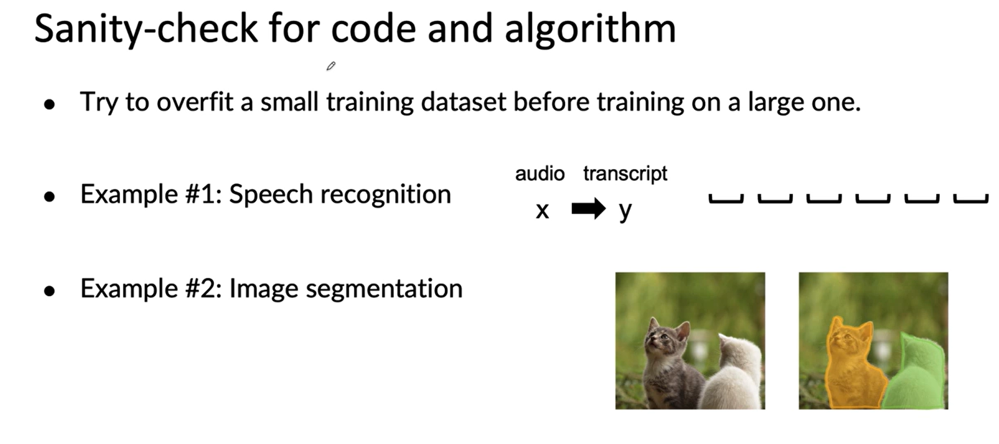

## Key Challanges

    This material discusses the challenges of trading machine learning models and highlights the importance of both code and data in AI systems. It emphasizes the need to focus on improving the data rather than just the algorithm or model. The process of model development is described as iterative, involving training the algorithm on data, analyzing errors, and making improvements. The three key milestones in building a model are achieving good performance on the training set, the development set, and the test set. However, it is noted that high test set accuracy may not be sufficient to meet the goals of the project, leading to the need for additional considerations such as business metrics. The next video will delve deeper into these topics.

## Low Average Performance
    In this course on Machine Learning in Production, we explore the challenges and strategies involved in deploying machine learning models successfully. The course covers various topics such as concept drift, data drift, and the importance of performance on key examples. We also discuss the issue of fairness and discrimination in machine learning systems and the need to ensure unbiased decision-making. Additionally, we examine the impact of rare classes and skewed data distributions on model accuracy. Throughout the course, we emphasize the importance of going beyond average test set accuracy and focusing on solving real-world business needs.

## Baseline

    Better to establish baseline accuracy then improving the where it is needed

    This saves effort and time

    This section focuses on the importance of establishing a baseline when starting a machine learning project. It explains that establishing a baseline level of performance is crucial before making improvements. The example of speech recognition is used to illustrate this concept. The section also discusses the difference between unstructured and structured data and how baselines are established differently for each. It suggests methods such as measuring human level performance, conducting a literature search, looking at open source results, and using previous system performance to establish baselines. The section emphasizes the importance of setting a baseline before making predictions about accuracy and highlights the efficiency it brings to the project. It concludes by mentioning additional tips for getting started quickly on a machine learning project.

## Additional Tips
    In this section of the course, we learn about some tips for getting started on a machine learning project. The main focus is on the iterative process of machine learning, where we start with a model, data, and hyperparameters, and then train the model and carry out error analysis to drive further improvements. The first tip is to start with a quick literature search to see what's possible, rather than obsessing over the latest algorithms. It is also important to consider deployment constraints, such as compute constraints, when picking a model. However, if you're still in the early stages of the project and trying to establish a baseline, you can ignore deployment constraints for now. Another tip is to run quick sanity checks on your code and algorithm before training on a large dataset. This helps identify bugs and ensure that the algorithm is working correctly. Finally, after training a machine learning model, error analysis is crucial to determine how to improve its performance.

Deployment Constraints

    Yes if baseline is established and goal is to build

Sanity Checks

