# Error
## Error Analysis

    No algo will work in first time. ML process is an error analysis and we need to identify what is most efficient

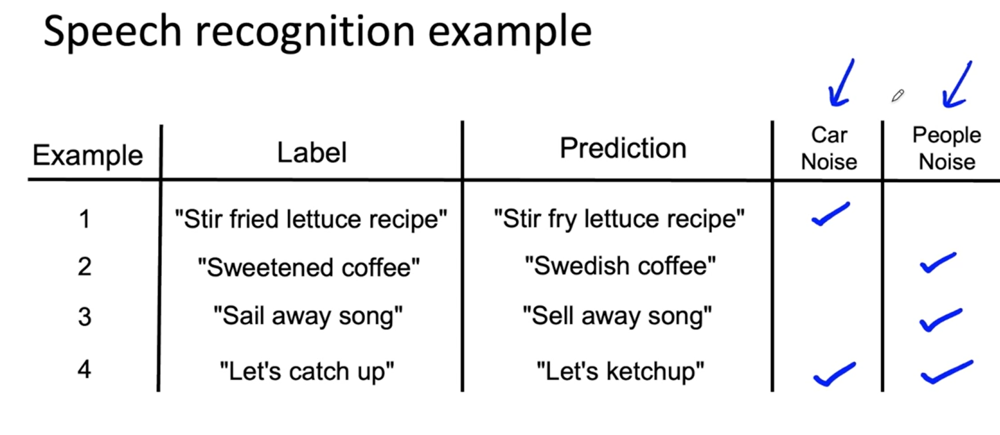

    In the above example you may come up with additonal tags. And check that, and then see if some other data has the same problem. You create a spreadsheet and then mark it.

    This process makes me understand catogries may be source of error and is worthy of more analysis. 
    
    There are multiple mlops tools which is making the life easy

    Error Analysis is also an iterative process

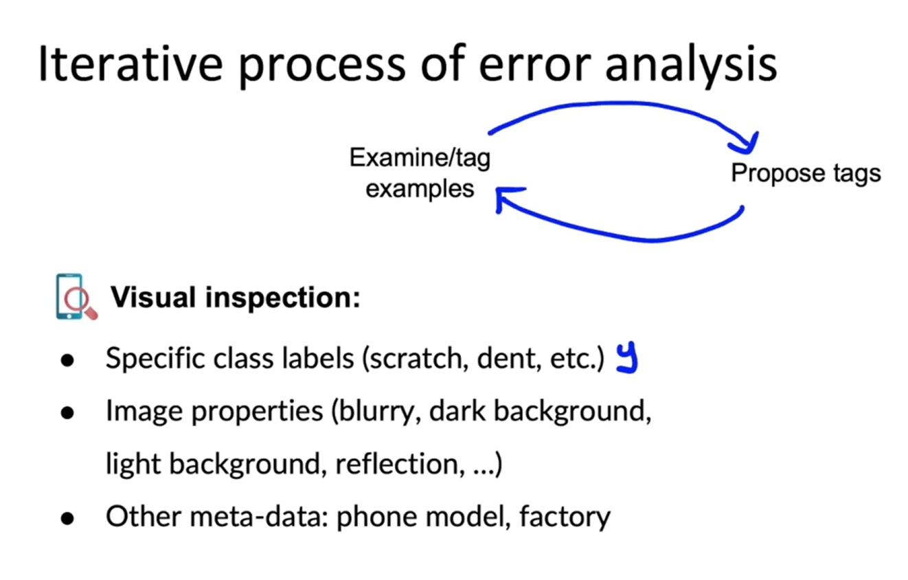

    The ultimae aim is that you come up with some tags that will imprve the algorithm

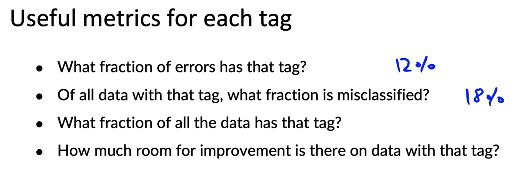

    By brainstorming different tags, you can segment your data into different categories and then use questions like these to try to decide what to prioritize working on.

## Priroritizing work

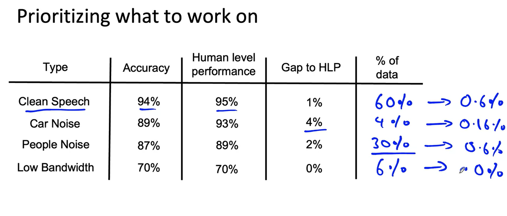

    

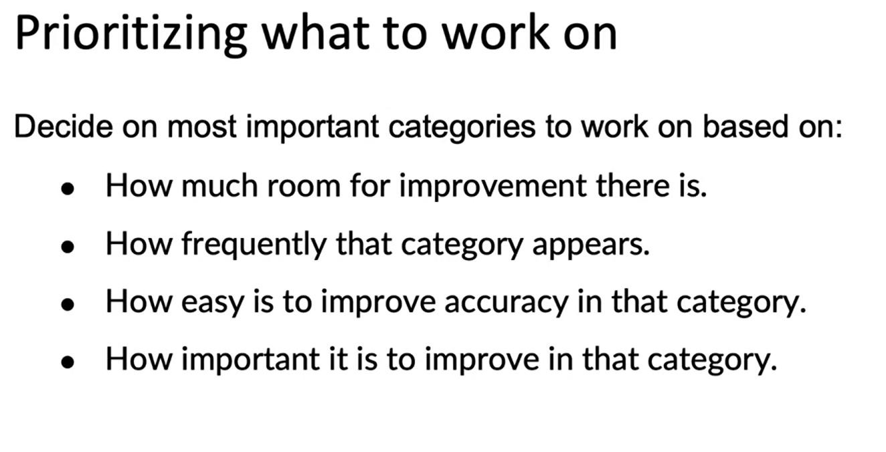

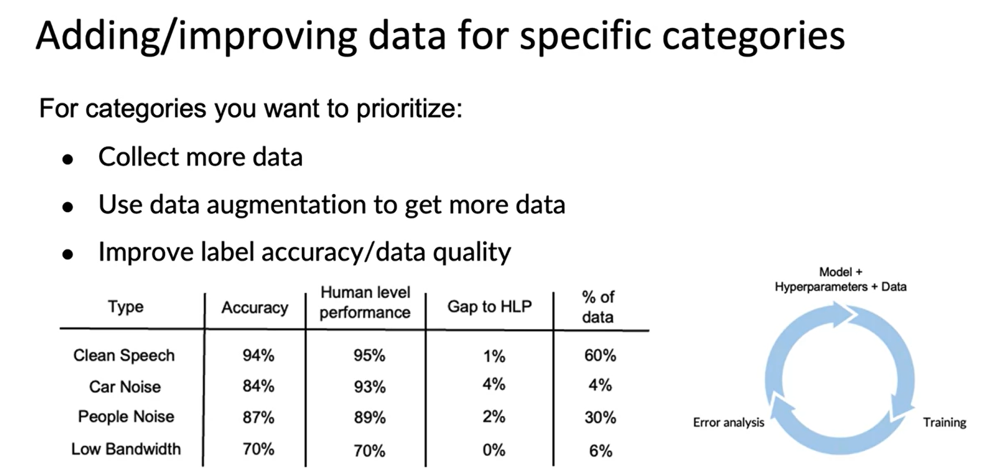

## Skewed Datasets
    Ratio of positive to negative when very far from 50-50 is when we called datasets as skewed

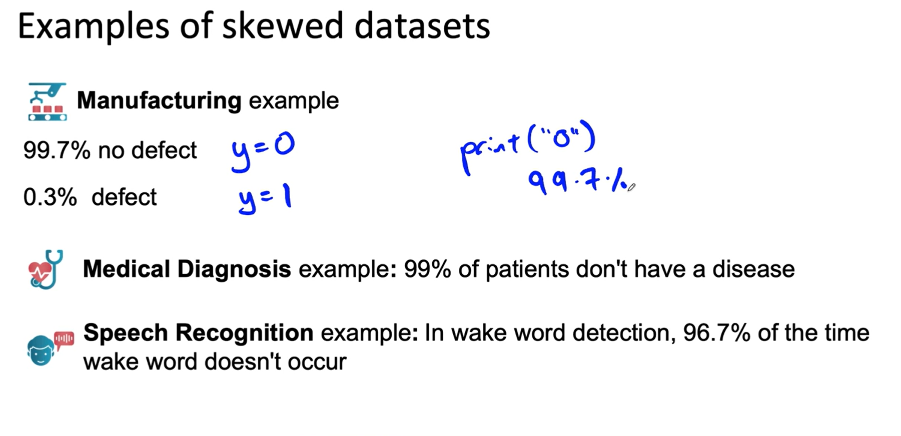

    Confusion Matrix is better in such case

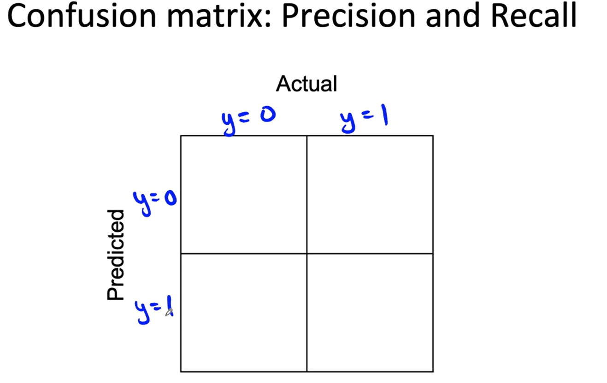

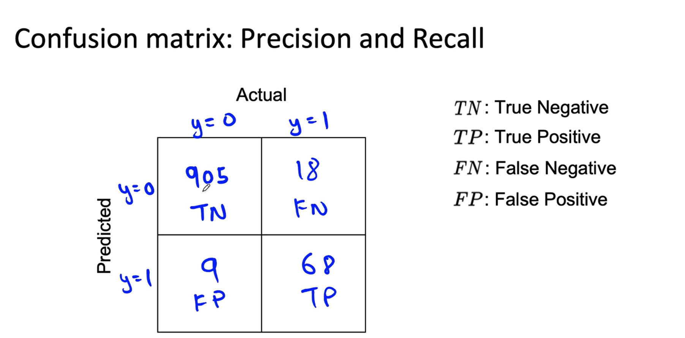

> 914 negative examples and 86 postive examples

> 
> 

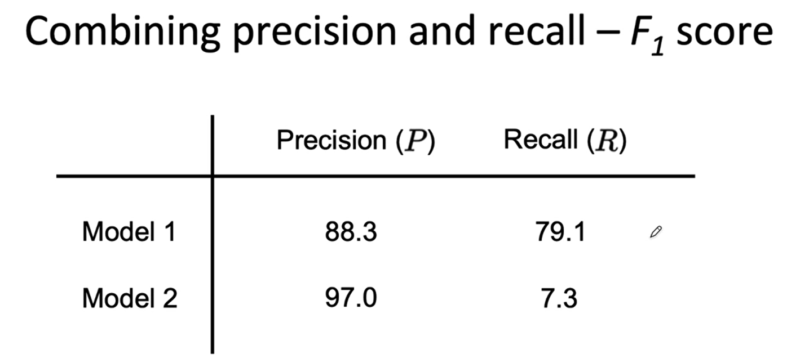
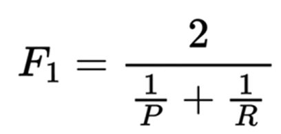

More uses of precision on recall - They are useful for multi class  classification algos

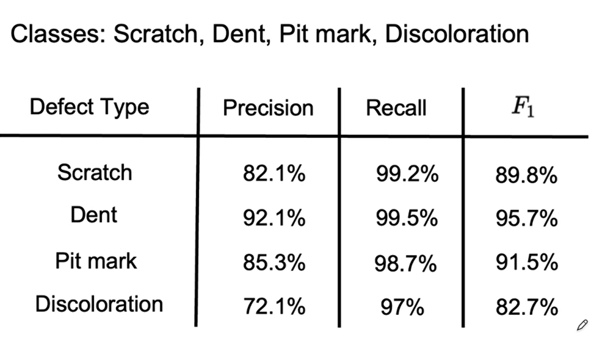

## Perfromance Auditing

    This can save you from post prod problems

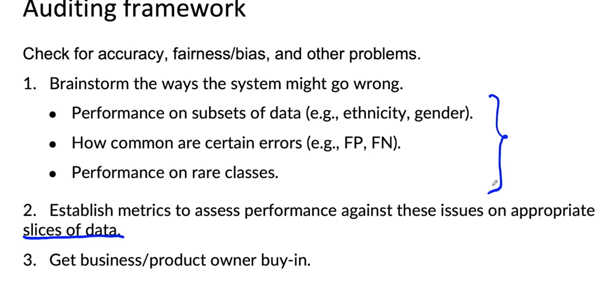

# Data Centric Dev
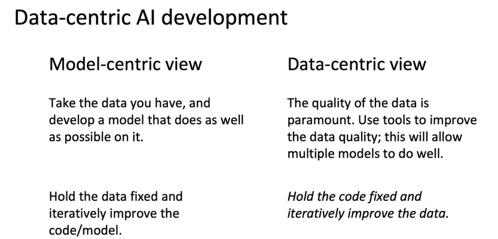

    Model-centric approaches excel in interpretability and efficiency, making them ideal for simpler tasks and situations where understanding the model's reasoning is crucial. Data-centric approaches shine in accuracy and adaptability, making them better suited for complex tasks and scenarios where large amounts of data are available. A hybrid approach can combine the strengths of both, offering a balanced solution when both interpretability and high accuracy are desired. The choice depends on the specific task, data availability, and desired level of interpretability.

## Data Augmentation

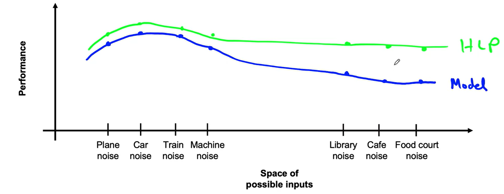

if you try to make it work, like collect more data on Cafe noise and then work on it, it will not only improve the performance on the cafe noise but also on the other points as well

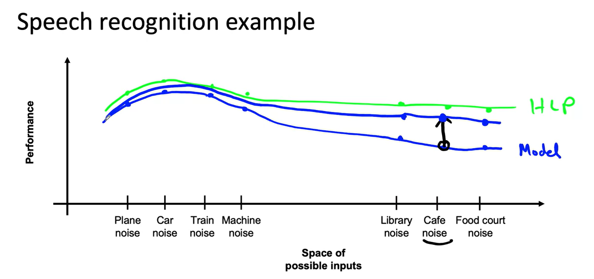

As you can see marked points on blue sheets, they help us in identify from where we can pull up the performance so that we get good results

>Data augmentation  - is a powerful technique in machine learning that involves artificially increasing the size and diversity of your dataset by creating new data points based on existing ones. This helps to improve the performance and robustness of your models, especially when dealing with limited data.

    Goal - 
        1.create Realistic points on which algo does poor but humans works well.
    
    Checklist:
        1 Is it realistic
        2 is x -> y mapping clear
        3 is algo doing poorly on this new data
    

    Data iteration loop approach results in fast improvents

    Unstrcutred data problem Data Augmentation works good. We can use the augmentation method to generate better data that suits our case

## Adding Data - Disadvantage or Advantage

If we use training and test dataset have same distribution, after augmentation this distribution might change more than uncanny. Can this hurt, ususally no but with few exception.

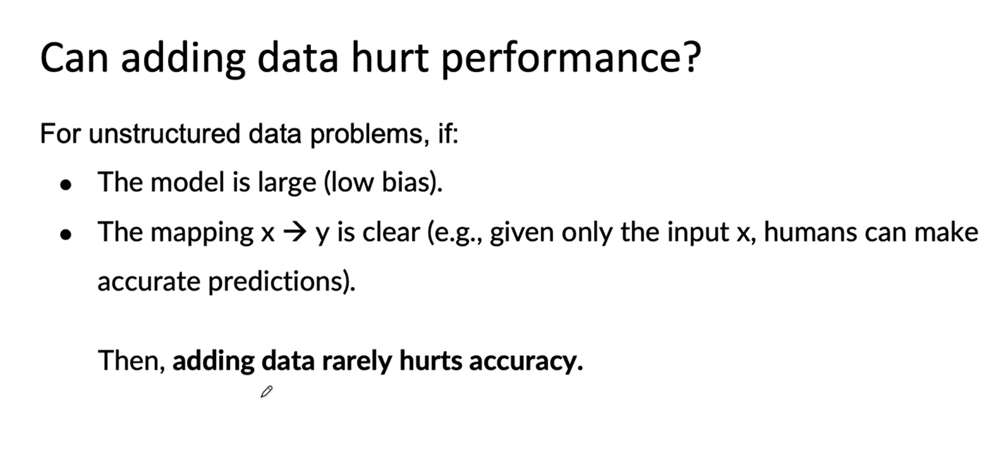

Adding accurately labelled data will not hurt the accuracy most of the times in case of large models

Ambigous data will skew the data and hurt the performance

## Structured Data Problem

Creating New Data is tough for  Structured so we need to identify, wether we can create the aditional features in the existing data.

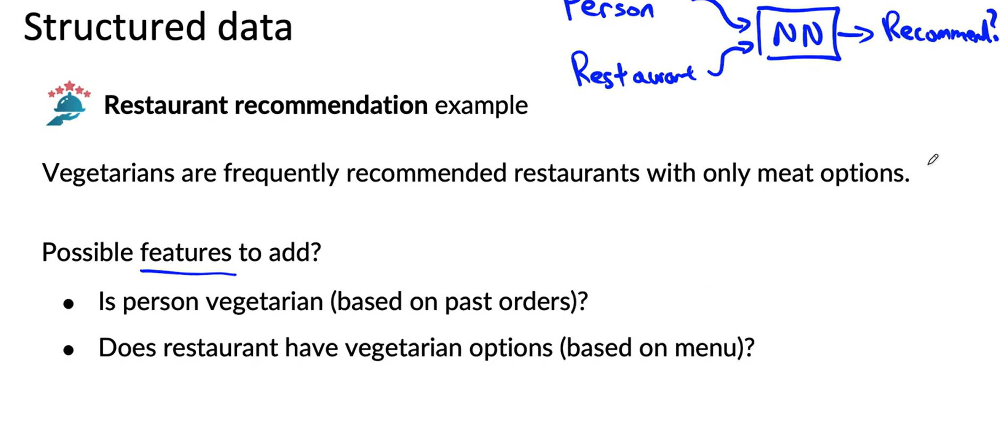

Additional Features are way better than generating the augmented data

In last few years approach has changed from collabrative features to content based filtering

Error Analysis is hard if there is no baseline, and HLP is not possible  on structured data. But  can give good feedbacks and provide you with extra features possible to be added.

# Experiment Tracking

## What to track
    Algo/code version
    Data used
    hyperparameters
    Results(possible maetrics, pickle file of model)]

## Tracking tool

    Text files
    Spreasheets(shared for teams)
    Expermient Tracking system(MLFLOW, sagemaker)

## Desirable Features
    Information needed to replicate result
    Experiments results ideally with summaru metrics/analysis
    Resource monitoring, visualization, error analysis

> Keep atleaset one system rather than wasting time which one to use, having the most basic info will help in replicating the result

# Data

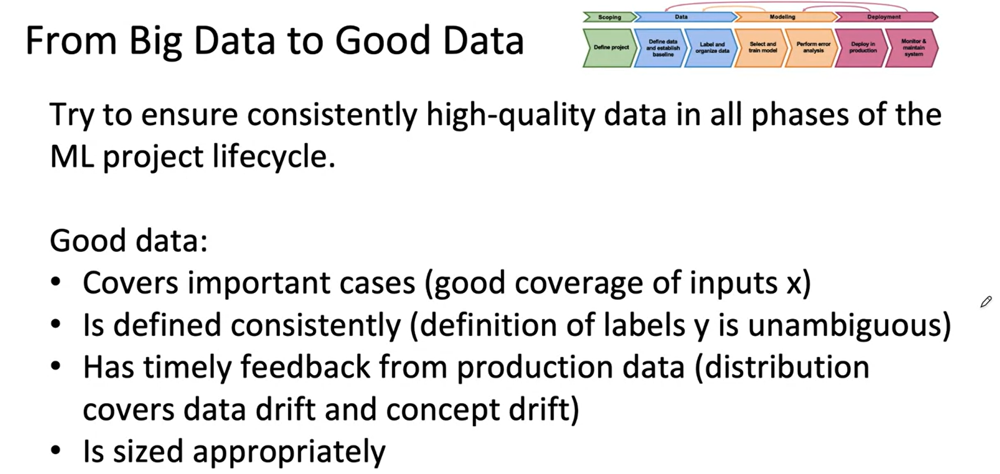

> https://blog.ml.cmu.edu/2020/08/31/3-baselines/
> https://techcommunity.microsoft.com/t5/ai-machine-learning-blog/responsible-machine-learning-with-error-analysis/ba-p/2141774
> https://neptune.ai/blog/ml-experiment-tracking